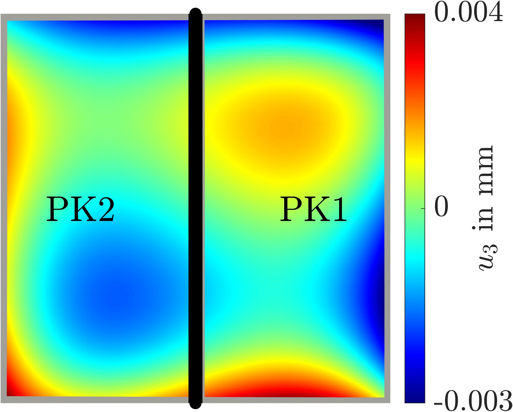

# CSWP-Voigt - The Cross Sectional Warping Problem in Voigt notation 

This repository accompanies the publication "The cross-sectional warping problem for hyperelastic beams: An efficient formulation in Voigt notation" [[Link to the published paper](#)] and provides the source code and analysis environments for the results presented therein. 

CSWP-Voigt is an extension and modification of the NLIGA framework originally developed by Du et al. (2020). If you intend to use this software, please give credit by citing the following articles:

**Article 1 (ours)**
> [Citation data for our publication]

**Article 2 (NLIGA Framework)**
```bibtex
@article{Du2020,
    title = {{NLIGA}: {A} {MATLAB} framework for nonlinear isogeometric analysis},
    author = {Du, Xiaoxiao and Zhao, Gang and Wang, Wei and Guo, Mayi and Zhang, Ran and Yang, Jiaming},
    journal = {Computer Aided Geometric Design},
    volume = {80},
    pages = {101869},
    year = {2020},
    doi = {10.1016/j.cagd.2020.101869},
    url = {[https://linkinghub.elsevier.com/retrieve/pii/S016783962030056X](https://linkinghub.elsevier.com/retrieve/pii/S016783962030056X)},
    issn = {01678396},
    language = {en}
}
```


## Description
CSWP-Voigt expands the functionalities provided by the NLIGA-framework to include: 

* **Advanced Formulations:** Functionally equivalent hyperelastic PK1 and PK2 formulations to solve the Cross-sectional warping problem using non-linear isogeometric Finite Element Analysis.
* **Interactive Environments:** Dedicated environments used to generate the results found in the previously mentioned publication (see `CS_Warping/analysis`).
* **Visualization Tools:** Tools to easily interpret and visualize the converged solutions (see `CS_Warping/visualization`).
* **Postprocessing:** Computation of resulting beam forces, beam moments, and beam stiffnesses acting on the cross-section.
* **Demonstration Environments:** Scenarios to showcase the different capabilities and options of the framework.
* **Material Models:** Multiple easily interchangeable hyperelastic material models, including Saint-Venant Kirchhoff, Mooney-Rivlin, and Neo-Hookean.
* **Presets and Examples:** Input parameters for various geometries, material formulations, and boundary conditions (referencing NLIGA for the geometry handling).

Handling of the B-splines and their resulting geometries and shape function (derivatives) is further provided via the NLIGA-Framework.


## Installation

### Requirements
* **MATLAB:** Version R2024a or upwards is required. See [the MATLAB Download Page](https://de.mathworks.com/help/install/ug/install-products-with-internet-connection.html).
* **Core Framework:** The functionalities related to the cross-sectional warping problem are built upon the original NLIGA framework.

### Setup Steps
 1. **Repository Setup:** Clone or download this repository and ensure all subfolders are added to your MATLAB path
 2. **NLIGA Core:** Follow the installation and activation procedures as outlined in the [original NLIGA publication](https://github.com/raymonraymon/NLIGA).
 3. **Verification**: The cross-sectional warping modules run natively within the NLIGA environment and do not require additional compilers or toolbox dependencies beyond a standard MATLAB installation.

For further guidance on MATLAB-specific setups, please refer to the [official MATLAB documentation](https://www.mathworks.com/help/install/index.html).


## Usage

Examples of potential usages can be found in the folders `CS_Warping/demos` as well as `CS_Warping/results_paper`. As a short example, the file contents and results for `CS_Warping/demos/beam_effects/DEMO_beam_effects.m` are outlined below:

### Code Example
```matlab
% Define the loadcase (10% axial stretch)
% Attention: Always use upright vectors
eps0 = [0, 0, 0.1]';
k0 = [0, 0, 0]';

% Define Element type, Safe File and Boundary conditions
eltype = 30; % 30- CSWP element
filename = 'DEMO_Beam_Effects';
fname = get_output_file_name(filename);
fout = fopen(fname,'w'); 
dbc = []; % Dirichlet boundary conditions
tbc = []; % Von Neumann boundary conditions

% Define Material, Material Model Type, Geometry, Mesh
mat = default_mat();
mat.index = 114; % SVK with PK2 / Alternatives see "default_mat()"
geo = geo_square([0,0], 1);
mesh = build_iga_mesh(geo);

% Solve the NLIGA simulation
nl_return = nliga_returns(eltype, geo, mesh, mat, dbc, tbc, fout, eps0, k0);
u = nl_return.u; % Solution displacement vector
k = nl_return.k; % Solution stiffness matrix

% 1. Compute the Beam Forces acting on the cross-section
[forces, moments] = beam_forces(geo, mesh, mat, eps0, k0, u);
disp("Forces in [x,y,z]: ")
disp(forces);
disp("Moments in [x,y,z]: ")
disp(moments);

% 2. Compute the Beam Stiffness Matrix (Sensitivity of Forces and Moments)
[C0] = beam_stiffness(geo, mesh, mat, eps0, k0, u, k);
disp("Beam Stiffness Matrix [6,6]: ")
disp(C0);
```

### Expected Output
The expected output of the program should look like this:

```text
     time    time step    iter    residual 
   1.00000  1.000e+00     1    1.00000e+06 
   1.00000  1.000e+00     2    1.88283e-01 
   1.00000  1.000e+00     3    9.84428e-07 

Forces in [x,y,z]: 
         0         0   24.0424

Moments in [x,y,z]: 
   1.0e-15 *
    0.1735   -0.2186         0

Beam Stiffness Matrix [6,6]: 
   84.3096   -0.0000         0         0         0    0.0000
   -0.0000   84.3096         0         0         0   -0.0000
         0         0  273.7303    0.0000   -0.0000         0
         0         0    0.0000   21.3690   -0.0000         0
         0         0   -0.0000    0.0000   21.3690         0
   -0.0000    0.0000         0         0         0   13.2822
```


Further examples can be found in the repository.


## Exemplary Visualizations

Below you may find an exemplary results visualized using this software, corresponding to Fig. 4a in the published paper.
Shown are the PK1 and PK2 derived out-of-plane displacement responses to a multi-axial loading case on a square cross-section:

<p align="center">
  
  <br>
</p>


## Contact
For information regarding bugs, contributions, or additions related to this repository, please contact:
**Tobias Henkels** – [tobias.henkels@stud.tu-darmstadt.de](mailto:tobias.henkels@stud.tu-darmstadt.de)

## Authors and Acknowledgment

### Authors of the Publication
| Name | Contact |
| :--- | :--- |
| Juan C. Alzate Cobo | [alzate@cps.tu-darmstadt.de](mailto:alzate@cps.tu-darmstadt.de) |
| Tobias Henkels | [tobias.henkels@stud.tu-darmstadt.de](mailto:tobias.henkels@stud.tu-darmstadt.de) |
| Oliver Weeger | [weeger@cps.tu-darmstadt.de](mailto:weeger@cps.tu-darmstadt.de) |

### Code Development
The core CSWP-NLIGA modules and analysis environments were developed by:
* **Juan C. Alzate Cobo**
* **Tobias Henkels**

---

## License

This project is licensed under the **GNU General Public License v3 (GPL-3.0)**. 
A full copy of the license is available in this repository in the `LICENSE` file or online at the [GNU Operating System website](https://www.gnu.org/licenses/gpl-3.0.html).